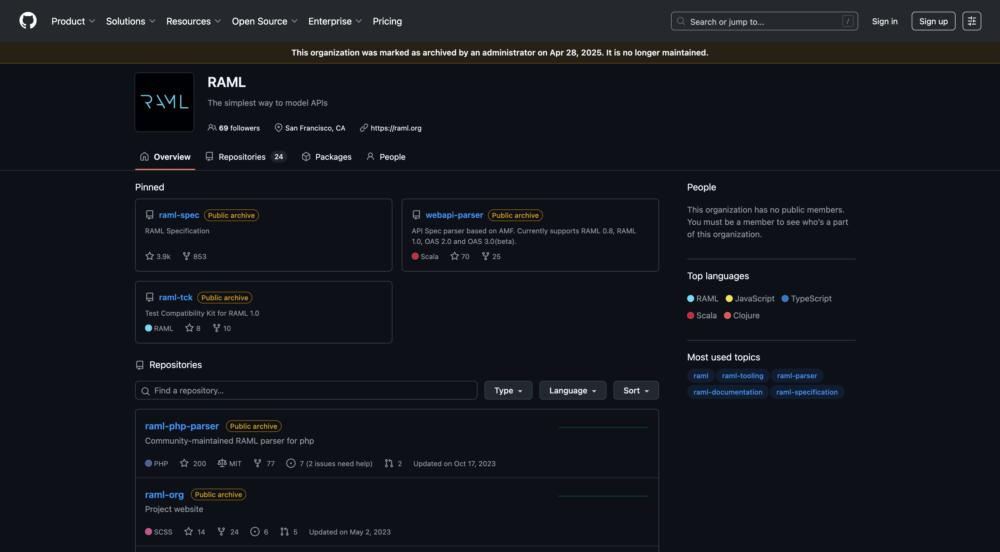

# Week 1: Application Networks & API-Led Connectivity

[Week 1: Study Plan](/week-01/README.md)

I started this week by going to the Design Center on Anypoint Platform and created a new API specification. 

The Design Center lets you choose between designing an API from scratch with code or using a visual interface and also lets you choose between RAML and OpenAPI Specification (OAS) as the specification language.

I initially started with RAML code until I realized that I wanted a more guided experience, so I switched to the visual interface.

After researching RAML a bit more, I found that it has an [official website](https://raml.org/), but when you try to click on the `Try It Out` button, it redirects you to a page that doesn't exist.

There is also a [GitHub repository](https://github.com/raml-org) for RAML, but all of it's repositories have been archived.

Those two findings didn't give me confidence in using RAML, so I decided to switched to OpenAPI Specification (OAS). Luckily, switching in the Design Center is as simple as clicking the OAS button at the bottom right of the editor and downloading the specification.

Having worked with the Swagger UI before for API documentation, I tried importing the file into the [Swagger Editor](https://editor.swagger.io/) and verified that it looked as expected.

Finished files:
- [catalog-db-system-api.json](system-api/catalog-db-system-api.json)
